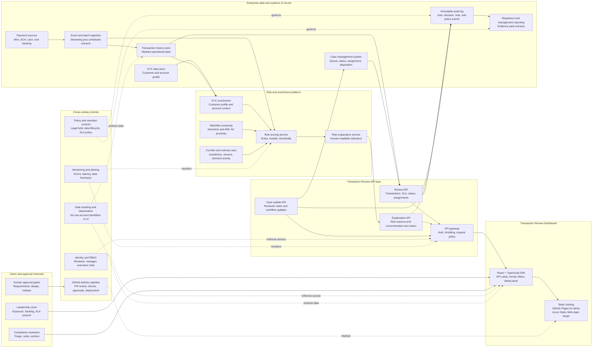
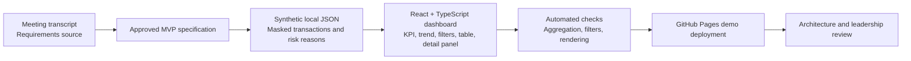

# Transaction Review Dashboard Architecture

## Architecture board summary

The Transaction Review Dashboard provides an executive and compliance view of transactions flagged for human review. The Friday MVP is a static React + TypeScript dashboard using synthetic data. The target-state architecture below shows how the same experience would integrate with enterprise payment, KYC, watchlist, case-management, audit, identity, and governance services.

## Target-state architecture

## MVP implementation slice

## Key design positions

| Area | Position |
| --- | --- |
| MVP boundary | Front-end-only static SPA with synthetic data; no backend, database, auth, or real client data in the prototype. |
| Target integration | Payment sources flow through ingestion, enrichment, risk scoring, explanation, case management, and audit logging. |
| Risk posture | Dashboard supports human review and triage; it must not present transactions as illegal or make automated final decisions. |
| Data protection | Mask identifiers in UI, tokenize sensitive fields, enforce RBAC, and retain only policy-approved review/audit data. |
| Explainability | Every high-risk item should show configured indicators such as watchlist proximity, unusual velocity, high-risk corridor, new beneficiary, dormant reactivation, or threshold exception. |
| Release governance | GitHub PRs, automated checks, environment approvals, and deployment logs provide traceability from requirement to release. |

## Architecture board decisions requested

1. Approve the MVP boundary as a static synthetic-data dashboard for leadership review.
2. Approve the target-state integration pattern: API-mediated access to transaction, risk, case, and audit services.
3. Confirm RBAC, masking, audit logging, retention, and human-in-the-loop review as mandatory production controls.
4. Confirm GitHub Pages for the demo and Azure Static Web Apps as the preferred enterprise hosting target.
