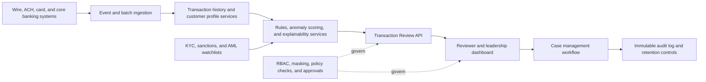

# Transaction Review Dashboard Copilot Demo Plan

## Executive story

A financial institution sees a sudden spike in high-risk wire activity ahead of a regulatory review. Leadership needs a lightweight Transaction Review Dashboard live quickly so compliance teams can triage exposure, understand risk drivers, and show a credible response path.

The demo shows GitHub Copilot agents compressing the SDLC from messy meeting notes to a deployed application while preserving human approval points, traceability, tests, and release controls.

## Audience

C-suite and senior executives in Financial Services: Chief Risk Officer, COO, CIO, CTO, Chief Compliance Officer, Head of Financial Crime, and transformation leaders.

## Demo promise

Copilot does not just autocomplete code. It can help autonomous agents move work across the SDLC: plan, design, build, test, and release, while humans stay in control of decisions and governance.

## Recommended 20-minute flow

| Phase | Time | Live action | Executive message |
| --- | ---: | --- | --- |
| Plan | 3 min | Start with a messy Microsoft Teams transcript and ask Copilot to produce requirements, user stories, success metrics, and acceptance criteria. | Initiatives usually start messy; Copilot turns ambiguity into structured execution. |
| Design | 4 min | Ask Copilot to generate a target-state architecture diagram, MVP scope, and architecture decisions. | Agents can reason from business goals to architecture, not just code. |
| Build & Test | 10 min | Use Copilot in VS Code, Copilot CLI, or the GitHub Copilot app to build a static React dashboard with mock data and tests. | Agents can perform implementation work autonomously while keeping changes reviewable. |
| Deploy & Release | 3 min | Push changes and deploy to GitHub Pages. Mention Azure Static Web Apps as the enterprise production path. | Delivery is traceable through repo history, checks, and deployment logs. |

## Demo app MVP scope

Build a static React dashboard using Vite, React, and TypeScript. Keep the application intentionally lightweight: no backend, no database, no auth, and no real customer data.

Core UI elements:

- KPI cards for flagged transactions, total exposure, high-risk items, and SLA breaches.
- Risk trend chart showing flagged transaction volume over recent days.
- Flagged transaction table with filters for risk level, transaction type, corridor, review status, and assigned team.
- Transaction detail panel showing risk reasons, reviewer notes, review status, and recommended next action.
- Synthetic transaction dataset stored locally in the app.

Implemented MVP assets:

- `src/data/transactions.ts` contains synthetic transaction records and configured indicators.
- `src/utils/dashboard.ts` contains KPI, SLA, filter, trend, and formatting utilities.
- `src/App.tsx` and `src/styles.css` provide the executive dashboard UI.
- `src/utils/dashboard.test.ts` validates dashboard calculations and filters.

## Target-state architecture to diagram

The design phase should show the broader enterprise architecture even though the live build only implements the static dashboard MVP.

Suggested target-state components:

- Transaction sources: wire, ACH, card, and core banking systems.
- Ingestion layer for transaction events and batch extracts.
- Data services for transaction history, KYC/customer profile data, sanctions lists, and AML watchlists.
- Risk services for rules, anomaly detection, risk scoring, and explanations.
- Transaction Review API for dashboard access and case updates.
- Frontend dashboard for compliance reviewers and leadership summaries.
- Controls for RBAC, audit logging, data masking, policy checks, and retention.
- Delivery pipeline using GitHub, GitHub Actions, environment approvals, and static hosting.

## Recommended deployment choice

Use GitHub Pages for the live demo because it is fast, simple, and reliable for a static Vite React app. Position Azure Static Web Apps as the production-grade option for enterprise hosting, identity integration, environments, and future API support.

## Human approval gates

Keep the autonomy message balanced with governance:

- Human reviews and approves the generated requirements.
- Human approves the architecture and MVP scope.
- Human reviews the pull request and checks.
- Human approves release or environment promotion.

## Demo preparation checklist

- Repository created and cloned locally.
- GitHub Pages deployment path prepared before the live demo.
- Mock Teams transcript ready as the starting input.
- Simple app stack selected: Vite, React, TypeScript, static data.
- Synthetic data only; no real customer or production data.
- Architecture diagram generated with Mermaid so it renders natively in GitHub Markdown.
